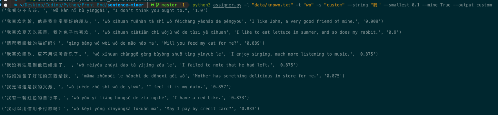

# chinese-sentence-miner
Filter and sort 18 000+ Simplified Chinese sentences to find those just right for you!

This program is perfect for finding new sentences that you'll be able to understand (e.g. for flashcards, rote learning) as well as visualizing your comprehension of Chinese texts.



## Features
*By adding a `.txt` document with your known vocabulary (such as `data/known.txt`) you can use the program to assign each sentence a 'custom ratio' - your known words divided by total words.*

- Assign custom ratios to sentences based on your known vocabulary
- Access sentences through a variety of filtering methods, such as by...
    - searching for specific word(s) in sentences
    - searching for sentences within an HSK or custom ratio range.
    - choosing the maximum number of sentences you'll get.
    - defining the minimum understanding of a sentence required.
- Visually graph your understanding of sentences
- Add and analyze your own sentences to the database
- Sort sentences based on their average HSK level or your custom ratio

## High-level Overview
The program is CLI-only, and contains ~18k sentences of varying difficulty stored in `data/sentences.tsv`, taken from Tatoeba. It allows you to search through these sentences using a simple set of rules - see **Usage**. While sentences can be searched for based on their HSK difficulty, the tool is most useful when you want to find sentences that *suit your level*.

This is because the `data/known.txt` file contains carriage-separated words that you know - currently holding an example of several hundred. By filling in this file, you can then filter sentences according to your understanding of them.

## Usage

**If you are unfamiliar with coding, you can also run the code online.**

[Run online](https://repl.it/@andersoncliffb/chinese-sentence-miner#README.md).

Make sure to check out at least the [examples](#examples) page to understand how to run the code.

*Usage with Anki: create a field named `Sentences` for the card template you are using with Chinese words. Create a sorted `sentences.tsv` file based on (ideally) 'custom' understanding. Steadily cmd-f your way through each word in your Anki deck/use the CLI.*

*Note: you can also try exporting Anki decks as a txt file, modifying them, and then re-importing them. Note that with CLI and depending on deck size, this may take some time.*

### Installation
1. Download this repository by clicking the green `code` button on the top right.
2. Navigate to wherever the folder with the program is stored in your Terminal.
3. Install Python requirements with `python3 -m pip install -r requirements.txt`.
4. Run `python3 assigner.py` with your [desired flags](#flags).

*Note: parsing nearly 20 000 sentences takes time. Commands take roughly 15-25 seconds to execute.*

### Flags
`chinese-sentence-miner` has many flags you can use to filter or visualize sentences. If you're ever lost, you can always type in `python3 assigner.py --help` to see the flags and their descriptions, or consult this guide.

Detailed information about each flag is in this section. To see some examples (recommended for new users), you can go down to the [examples](#examples) section.

*Note: True/False flags **must** be set using a capital T and capital S.*

```
usage: assigner.py [-h] [-v VISUALIZE] [-l LOCATION] -t TYPESPLIT [-s SORT] [--string STRING] [--smallest SMALLEST] [-e EASY] [-i INCLUDE] [--limit LIMIT] [-m MINE] [-d DEVIATION] [--target TARGET] [-o OUTPUT]

optional arguments:
  -h, --help            show this help message and exit
  -v VISUALIZE, --visualize VISUALIZE
                        whether to visualize results
  -l LOCATION, --location LOCATION
                        location for known user vocabulary
  -t TYPESPLIT, --typesplit TYPESPLIT
                        whether to split sentences character by character (ch) or word by word (wo)
  -s SORT, --sort SORT  whether to sort sentences by 'HSK' or 'custom' (user ratio)
  --string STRING       string used when searching sentences, split words by space
  --smallest SMALLEST   smallest ratio of sentences known when searching (default is 0.6)
  -e EASY, --easy EASY  whether to output 'custom' sentences the user is most likely to understand (default True), as opposed to any sentences above the `smallest`
  -i INCLUDE, --include INCLUDE
                        whether to add custom sentence ratio to `data/sentences.tsv` (requires `location`, default True (with working `location`))
  --limit LIMIT         number of sentences outputted
  -m MINE, --mine MINE  whether or not to mine sentences (default is False)
  -d DEVIATION, --deviation DEVIATION
                        HSK/user ratio deviation when searching for sentences (default of 0.2 means for 3 you will find sentences from 2.8 - 3.2)
  --target TARGET       target HSK level (int/float) when searching for sentences
  -o OUTPUT, --output OUTPUT
                        output type & visualization type - return HSK sentences (default of 'HSK') or custom ratio sentences ('custom'), required for visualization and sentence mining
```
<center><em>Output of <code>python3 assigner.py --help</code>.</em></center>

#### location
*Flags: `-l`, `--location`*

This flag governs where your known vocabulary is. The example known vocabulary is in `data/known.txt`, so this would be used as `python3 assigner.py --location "data/known.txt"`. **This is required for sorting by custom ratio, visualizing custom ratio, and outputting sentences based on custom ratio.**

#### output
*Flags: `-o`, `--output`*

**Important flag!**

When searching for sentences, you can use `output` to specify whether the other flags refer to sentences using `"HSK"` or `"custom"` (for custom ratios).

#### mine
*Flags: `-m`, `--mine`*

A key feature of this program is the ability to output useful sentences - this is called sentence mining. Running the program without any flags won't output any sentences - you need to set `mine` to True in order to actually have sentences printed out. Ex. `python3 assigner.py --mine True`.

#### visualize
*Flags: `-v`, `--visualize`*

This flag governs whether or not a visualization of the sentences is outputted. This visualization is a line chart that displays your understanding of every sentence, *or* the HSK level of each sentence (based on the [output flag](#output)).

It is set to `False` by default, and setting it to `True` is done via `python3 assigner.py --visualize "True"` and will output a Plotly line chart in the browser.

<hr>

#### typesplit
*Flags: `-t`, `--typesplit`*

With this flag, you can choose how the sentences are split (useful during analysis, sorting, visualization, outputting, etc.) The default is `"wo"`, which means the sentences are divided word by word. However, you can set it to be `"ch"`, which will split the sentences character by character. This is useful because it will provide more sentences to you that are well known, and if you feel confident in your *characters*, this mode is for you.

#### sort
*Flags: `-s`, `--sort`*

This flag governs how `data/sentences.tsv` is sorted. The default is no sorting. However, if you set it to `"HSK"`, the sentences in the file will be ordered from lowest to highest HSK. If you set it to `"custom"`, the sentences in the file will be ordered from most understandable to least understandable.

#### include
*Flags: `-i`, `--include`*

Simply running the code will automatically rewrite `sentences.tsv` with the HSK ratio. If you'd also like to add your custom ratios (on by default with a valid `location`), keep this flag at True. If not, set it to False. Highly recommended to keep at True.

<hr>

#### string
*Flag: `--string`*

This flag is used for when you are looking to output sentences. When you normally mine sentences, any sentence that fills the criteria will be outputted. However, with this flag, you can add a string, and only sentences that fulfill it will be outputted.

The format for adding strings is as follows (illustrated by examples):
- search for only one pattern (e.g. 妈妈) - `python3 assigner.py --string "妈妈"`
- search for multiple patterns (each sentence must contain both of these patterns, e.g. 我 你) - `python3 assigner.py --string "我 你"` - they are separated by spaces.

#### limit
*Flag: `--limit`*

Sets a limit on the number of sentences outputted. The default number of sentences mined is 10, you can change that to any integer with the `limit` flag.

#### deviation
*Flags: `-d`, `--deviation`*

When searching for HSK/custom ratio sentences using the `output` flag, there is some leeway with the search. For example, if you set the `target` HSK level at 3.5, it would search for sentences within the range of 3.3 and 3.7.

#### smallest
*Flag: `--smallest`*

When searching, this flag specifies the minimum understanding required. For example, when searching for sentences using custom ratio, you could require that you understand 90% of sentences by setting this flag to `0.9`.

#### easy
*Flags: `-e`, `--easy`*

By default True, easy determines whether only the easiest sentences are shown when outputted. For example, with a minimum of 0.0, any 20 sentences could be shown to the user. With `easy` set to True, only the easiest (ratio closest to 1.0) would be shown. It's a good idea to set this to False if you want more random sentences, as you can also ensure sentences are at your level with `deviation` and `minimum`.

#### target
*Flag: `--target`*

When searching for HSK sentences, use `target` to specify what level sentences you want (consider deviation). Example: searching for HSK 2 sentences: `python3 assigner.py --mine True --output "HSK" --target 2`.

Sentences are graded by HSK difficult by finding the average HSK level of all their words (or characters, with `typesplit` set to `"ch`). Words not in HSK are assigned a value of 7.

### Examples
*Search for HSK sentences with an average of 4.3 using word-by-word splitting.*
```bash
python3 assigner.py -l "data/known.txt" -t "wo" -o "HSK" --mine "True" --target 4.3
```

*Search for one HSK sentence with 妈妈 in it using word-by-word splitting.*
```bash
python3 assigner.py -l "data/known.txt" -t "wo" -o "HSK" --mine "True" --string "妈妈" --limit 1
```

*Sort `sentences.tsv` based on ascending HSK averages using character splitting, and then create a line chart of it.*
```bash
python3 assigner.py -l "data/known.txt" -t "ch" -o "HSK" -s "HSK" -v "True"   
```

*Sort `sentences.tsv` based on descending custom ratio order using word-by-word splitting. Then search all sentences that contain both 我 and 你, searching for sentences based on custom ratio and ensuring they all have at least 40% of their words understood. Pick any sentences between 0.4 and 1 comprehension (i.e. not only those with the highest comprehension).*
```bash
python3 assigner.py -l "data/known.txt" -t "wo" -s "custom" --string "我 你" --smallest 0.4 --easy False --mine True --output custom
```

## Contributing

### Sentences
The easiest way to contribute is by adding sentences to `data/sentences.tsv` - the wider range of sentences, the better!

Please use the following format when adding new sentences, as the file uses tab-separated values.

```
<sentence in Simplified characters><tab><sentence in pinyin><tab><meaning in English>
```

### Code
Code contributions are welcome! Some of the following are potential improvements that could be made:

- [ ] cleaner visualization of sentence distribution
- [ ] support for numbers when splitting with `jieba` (e.g. `三十五`) without adding manually
- [ ] implement searching for target custom ratio (e.g. looking for custom ratio of 0.5)
- [ ] likewise implement `deviation` flag support when done

## Credit
`hsk.json` uses data from the MIT-licensed [hsk-vocabulary](https://github.com/clem109/hsk-vocabulary) repository.

First 18896 sentences taken from [this post](https://www.plecoforums.com/threads/18-896-hsk-sentences.5615/) on Pleco Forums, which was in turn taken from a [tatoeba](https://www.tatoeba.org) sentence list.
